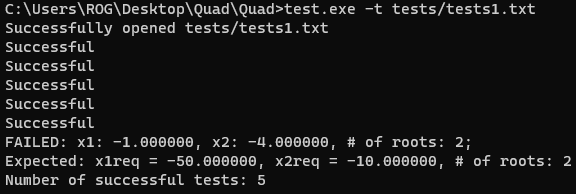

# Quadratic equation solver
A simple program written in C that's designed to solve all types of quadratic equations!

### About the project
This project is a simple console application that's able to solve all quadratic equations in different modes. For example, it's also able to perform unit-tests that are specified in a text file.

### How to setup the program?
* Get the TXLib library from [here](http://storage.ded32.net.ru/Lib/TX/TXUpdate/Doc/HTML.ru/)
* Clone this repository by using the following command:
  
  ```
  git clone https://github.com/QuickSpace/Quad.git
  ```
* Run `compile.bat`:
  
  ```
  .\compile.bat
  ```
### Usage
The program can be run in multiple modes (specified by command-line arguments):
* `-h` — get the description for all command-line options, the program's output will be something like:
  
  ```
    Quadratic equation solver.
  Options:
           -t - running tests
           -h - print help
    ```
* `-t <path>` — use the specified file to perform unit-tests (you can specify `default` as an argument to use the following default file: `./tests/tests.txt`):
  <p align='left'>
    
  </p>
* You don't have to specify any arguments to run this program in the default mode. This program can only comprehend the following input format:
   
  ```
  %d %d %d
  ```
  This means that, for example, the following will work:
  
  ```
  8 9.7 -17.0
  ```
  And this won't:
  
  ```
  8.1 abcd -1
  ```
  If the input format is incorrect, you can retry entering your coefficients after declining the exit prompt.
